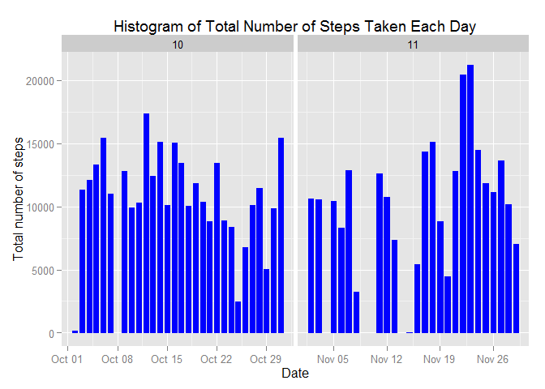
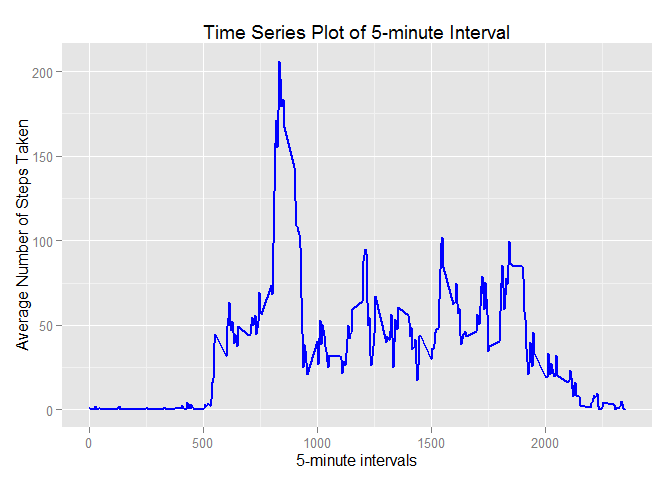
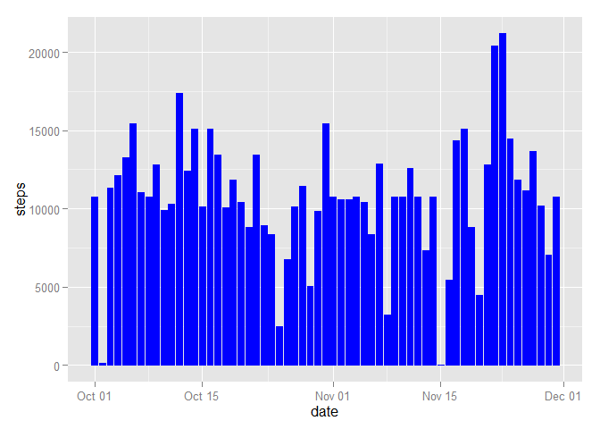

# Reproducible Research: Peer Assessment 1


###  Loading and preprocessing the data

```r
library(ggplot2)
library(lattice)

setwd("C:/coursera/ReproducibleResearch")

data <- read.csv("activity.csv", colClasses = c("integer", "Date", "factor"))
dim(data)
```

```
## [1] 17568     3
```

```r
cleanData <- na.omit(data)
cleanData$month <- as.numeric(format(cleanData$date, "%m"))
rownames(cleanData) <- 1:nrow(cleanData)
head(cleanData)
```

```
##   steps       date interval month
## 1     0 2012-10-02        0    10
## 2     0 2012-10-02        5    10
## 3     0 2012-10-02       10    10
## 4     0 2012-10-02       15    10
## 5     0 2012-10-02       20    10
## 6     0 2012-10-02       25    10
```

### What is mean total number of steps taken per day?


```r
totalSteps <- aggregate(cleanData$steps, list(Date = cleanData$date), FUN = "sum")$x
mean(totalSteps)
```

```
## [1] 10766.19
```

```r
median(totalSteps)
```

```
## [1] 10765
```

```r
ggplot(cleanData, aes(date, steps)) + geom_bar(stat = "identity", colour = "blue", fill = "blue", width = 0.7) + 
        facet_grid(. ~ month, scales = "free") +
        labs(title = "Histogram of Total Number of Steps Taken Each Day", x = "Date", y = "Total number of steps")
```

 
        
### What is the average daily activity pattern?


```r
avgSteps <- aggregate(cleanData$steps, list(interval = as.numeric(as.character(cleanData$interval))), FUN = "mean")
names(avgSteps)[2] <- "avgSteps"
```

```r
ggplot(avgSteps, aes(interval, avgSteps)) + geom_line(color = "blue", size = 0.8) + labs(title = "Time Series Plot of 5-minute Interval", x = "5-minute intervals", y = "Average Number of Steps Taken")
```

 


### Imputing missing values


```r
sum(is.na(data))
```

```
## [1] 2304
```

```r
newData <- data 
for (i in 1:nrow(newData)) {
        if (is.na(newData$steps[i])) {
                newData$steps[i] <- avgSteps[which(newData$interval[i] == avgSteps$interval), ]$avgSteps
        
        }
}

head(newData)
```

```
##       steps       date interval
## 1 1.7169811 2012-10-01        0
## 2 0.3396226 2012-10-01        5
## 3 0.1320755 2012-10-01       10
## 4 0.1509434 2012-10-01       15
## 5 0.0754717 2012-10-01       20
## 6 2.0943396 2012-10-01       25
```

```r
sum(is.na(newData ))
```

```
## [1] 0
```


```r
ggplot(newData, aes(date, steps)) + geom_bar(stat = "identity",
                                             colour = "blue",
                                             fill = "blue",
                                             width = 0.8) 
```

 


### Are there differences in activity patterns between weekdays and weekends?


```r
newData$weekdays <- factor(format(newData$date, "%A"))

head(newData$weekdays)
```

```
## [1] Monday Monday Monday Monday Monday Monday
## Levels: Friday Monday Saturday Sunday Thursday Tuesday Wednesday
```

```r
levels(newData$weekdays) <- list(weekday = c("Monday", "Tuesday",
                                             "Wednesday", 
                                             "Thursday", "Friday"),
                                 weekend = c("Saturday", "Sunday"))


avgSteps <- aggregate(newData$steps, 
                      list(interval = as.numeric(as.character(newData$interval)), 
                           weekdays = newData$weekdays),
                      FUN = "mean")
names(avgSteps)[3] <- "meanOfSteps"
```


```r
xyplot(avgSteps$meanOfSteps ~ avgSteps$interval | avgSteps$weekdays, 
       layout = c(1, 2), type = "l", 
       xlab = "Interval", ylab = "Number of steps")
```

 
